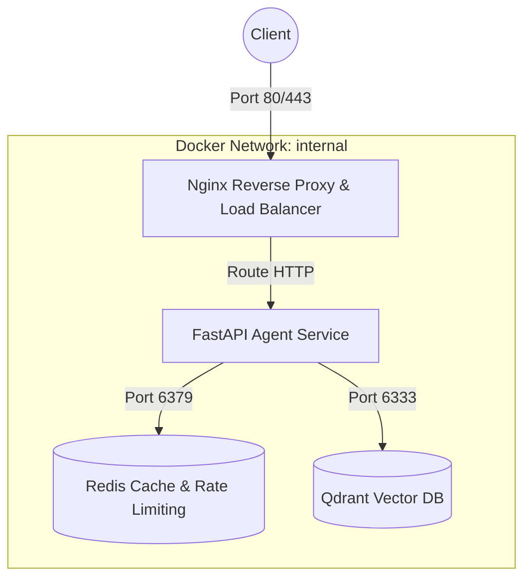

# Day 12 Lab - Mission Answers

## Part 1: Localhost vs Production

### Exercise 1.1: Anti-patterns found in develop/app.py
1. **Hardcoded Secrets:** API key (`OPENAI_API_KEY`) và Database URL (`DATABASE_URL`) bị gán cứng (hardcode) trong mã nguồn. Nếu đẩy code lên GitHub, các khóa bí mật này sẽ bị lộ ngay lập tức.
2. **Thiếu Config Management:** Các cấu hình ứng dụng (`DEBUG`, `MAX_TOKENS`) bị viết cứng trong code, không cho phép thay đổi linh hoạt theo từng môi trường chạy (Development, Staging, Production).
3. **Sử dụng lệnh `print()` và rò rỉ dữ liệu nhạy cảm:** Sử dụng hàm `print()` thay vì thư viện logging chuyên dụng. Đồng thời, in trực tiếp API Key bí mật ra màn hình log console (`print(f"[DEBUG] Using key: {OPENAI_API_KEY}")`).
4. **Không có Health Check Endpoints:** Thiếu các endpoint kiểm tra trạng thái hoạt động của dịch vụ (`/health`, `/ready`), khiến Cloud Platform hoặc Kubernetes không thể tự động theo dõi, định tuyến traffic hoặc tự động restart container khi app bị treo.
5. **Khóa cứng Host và Port:** Sử dụng `host="localhost"` (chỉ nhận request từ máy cục bộ, không thể kết nối từ Docker hay bên ngoài) và `port=8000` (port cố định thay vì đọc động qua biến môi trường `PORT` của cloud).
6. **Bật chế độ `reload=True` trên Production:** Chế độ debug auto-reload làm suy giảm nghiêm trọng hiệu năng hệ thống và có nguy cơ rò rỉ thông tin debug nhạy cảm.

### Exercise 1.3: Comparison table
| Feature | Basic (Develop) | Advanced (Production) | Tại sao quan trọng? |
| :--- | :--- | :--- | :--- |
| **Config** | Hardcode trực tiếp trong code | Load động từ Env vars qua `config.py` | Bảo mật thông tin nhạy cảm; dễ dàng thay đổi cấu hình giữa các môi trường mà không cần sửa đổi mã nguồn hay build lại code. |
| **Health check** | Không có | Có `/health` (Liveness) & `/ready` (Readiness) | Giúp Cloud Platform hoặc Kubernetes tự động kiểm tra trạng thái ứng dụng để tự khởi động lại (restart) khi crash hoặc dừng định tuyến traffic khi app chưa sẵn sàng. |
| **Logging** | Dùng `print()` không cấu trúc, log cả secret | Dùng thư viện `logging` chuẩn, structured JSON | Định dạng JSON giúp các hệ thống quản lý log tập trung (Datadog, Loki) dễ dàng parse và lọc log; tránh in ra các thông tin nhạy cảm. |
| **Shutdown** | Đột ngột (Abrupt) | Graceful Shutdown (dùng FastAPI lifespan & SIGTERM) | Đảm bảo hoàn thành các request đang xử lý dở dang, đóng kết nối DB sạch sẽ trước khi tiến trình bị kết thúc hoàn toàn, tránh mất mát dữ liệu. |

---

## Part 2: Docker

### Exercise 2.1: Dockerfile questions
1. **Base image:** `python:3.11` (Bản cài đặt Python đầy đủ, dung lượng lớn ~1 GB).
2. **Working directory:** `/app`.
3. **Tại sao COPY requirements.txt trước?** Để tận dụng cơ chế **Docker layer caching**. Do các thư viện phụ thuộc (`requirements.txt`) ít khi thay đổi hơn mã nguồn (`app.py`), việc copy và cài đặt dependencies trước giúp Docker tái sử dụng cache của layer này ở các lần build sau nếu không có thay đổi trong `requirements.txt`, từ đó tăng tốc độ build đáng kể.
4. **CMD vs ENTRYPOINT khác nhau thế nào?**
   - **`CMD`:** Thiết lập lệnh chạy mặc định khi khởi tạo container, có thể bị ghi đè hoàn toàn một cách dễ dàng nếu người dùng truyền lệnh khác khi thực hiện `docker run`.
   - **`ENTRYPOINT`:** Định nghĩa lệnh chạy cố định khó bị ghi đè hơn. Khi người dùng truyền thêm đối số lúc chạy `docker run`, các đối số này sẽ được truyền làm tham số đầu vào cho lệnh của `ENTRYPOINT` (chứ không ghi đè lên lệnh đó). Ngoài ra, ta có thể kết hợp `ENTRYPOINT` (chỉ định binary/câu lệnh chạy) và `CMD` (làm tham số mặc định).

### Exercise 2.3: Multi-stage build & Image size comparison

#### 1. So sánh kích thước (Ước lượng thực tế):
- **Develop (Basic):** Khoảng ~1.02 GB (Dùng base image `python:3.11` đầy đủ).
- **Production (Advanced - Multi-stage):** Khoảng ~150 - 180 MB (Dùng base image `python:3.11-slim` kết hợp Multi-stage build).
- **Mức độ chênh lệch:** Giảm khoảng **~85%** dung lượng.

#### 2. Tại sao Docker image đầu tiên (Develop) lại nặng?
- **Sử dụng Base Image đầy đủ:** Lệnh `FROM python:3.11` tải về một bản phân phối Python hoàn chỉnh dựa trên Ubuntu/Debian. Bản này bao gồm rất nhiều công cụ phát triển (như trình biên dịch `gcc`, `g++`, các công cụ build nâng cao `make`, `build-essential`, v.v.) và các thư viện hệ thống (system libraries) nặng nề không cần thiết khi chạy ứng dụng trong thực tế.
- **Single-stage build:** Toàn bộ quá trình từ chuẩn bị công cụ, biên dịch dependencies cho tới copy code đều diễn ra trên một image duy nhất. Mọi file rác, cache cài đặt (`pip cache`) phát sinh trong lúc build đều bị giữ lại trong image thành phẩm.

#### 3. Tại sao Docker image thứ hai (Production) lại nhẹ hơn nhiều?
Nhờ kết hợp 2 kỹ thuật tối ưu hóa cốt lõi:
- **Sử dụng Base Image rút gọn (Slim):** Cả hai giai đoạn đều bắt đầu từ `python:3.11-slim`, phiên bản rút gọn tối đa dựa trên Debian-slim, đã lược bỏ hầu hết các build tools hệ thống cồng kềnh, chỉ giữ lại runtime Python tối thiểu (dung lượng base image chỉ khoảng ~120 MB).
- **Áp dụng cơ chế Multi-stage Build (Xây dựng nhiều giai đoạn):**
  - **Stage 1 (Builder):** Sử dụng `python:3.11-slim AS builder`. Giai đoạn này cài đặt các công cụ build cần thiết (`gcc`, `libpq-dev`) để biên dịch và cài đặt các thư viện phụ thuộc (`requirements.txt`) vào thư mục cục bộ `/root/.local`. Stage này chấp nhận dung lượng lớn vì nó chỉ dùng để build, không dùng để chạy trực tiếp.
  - **Stage 2 (Runtime):** Sử dụng `python:3.11-slim AS runtime`. Giai đoạn này chỉ copy những gì thực sự cần thiết từ Stage 1 sang (chỉ copy thư mục chứa các thư viện đã cài đặt `/root/.local` và source code chính) bằng lệnh `COPY --from=builder`.
  - **Kết quả:** Tất cả các công cụ build nặng nề (`gcc`, `libpq-dev`, cache của pip) được dùng ở Stage 1 hoàn toàn bị bỏ lại phía sau và không xuất hiện trong image sản phẩm cuối cùng. Điều này giữ cho image chạy production cực kỳ nhẹ và an toàn.

### Exercise 2.4: Docker Compose stack

#### 1. Các Services được khởi động:
- **`agent`:** FastAPI AI Agent. Chạy logic chính của Agent và tiếp nhận các truy vấn API.
- **`redis`:** Redis server (`7-alpine`), giới hạn memory tối đa 256MB và dùng thuật toán LRU để dọn cache. Dùng cho lưu trữ session/lịch sử trò chuyện và giới hạn lưu lượng (rate limiting).
- **`qdrant`:** Vector Database (`v1.9.0`) hỗ trợ tìm kiếm ngữ nghĩa và lưu trữ tri thức cho RAG.
- **`nginx`:** Reverse Proxy & Load Balancer (`alpine`), nhận traffic từ cổng `80` và `443` ở máy host và phân tải tới service `agent`.

#### 2. Cách thức các Services giao tiếp (Communication):
- Tất cả các services cùng tham gia vào một mạng ảo biệt lập (`bridge`) tên là **`internal`**.
- Các service giao tiếp với nhau bằng cơ chế **Docker DNS nội bộ** thông qua tên của service (Service Name):
  - `agent` kết nối tới `redis` qua địa chỉ: `redis://redis:6379/0`
  - `agent` kết nối tới `qdrant` qua địa chỉ: `http://qdrant:6333`
  - `nginx` định tuyến (reverse-proxy) các yêu cầu từ bên ngoài tới `agent` qua địa chỉ: `http://agent:8000`
- **Bảo mật:** Chỉ có cổng `80` và `443` của service `nginx` là được công khai (expose) ra ngoài máy host. Các cổng của `agent` (8000), `redis` (6379), và `qdrant` (6333) đều bị ẩn khỏi môi trường bên ngoài để đảm bảo an ninh tuyệt đối cho hệ thống nội bộ.

#### 3. Architecture Diagram:

---

## Part 3: Cloud Deployment

### Exercise 3.1: Railway deployment (Vercel alternative used due to Railway workspace restriction)
- **URL:** https://railway-tau.vercel.app
- **Screenshot:** (Vercel deployment screenshot captured under artifacts as `vercel_root_response`)

---

## Part 4: API Security

### Exercise 4.1-4.3: Test results
*[Paste test outputs ở các phần sau]*

### Exercise 4.4: Cost guard implementation
*[Giải thích cách tiếp cận cho Cost Guard]*

---

## Part 5: Scaling & Reliability

### Exercise 5.1-5.5: Implementation notes
*[Ghi chú kết quả cài đặt và test stateless, graceful shutdown, health/ready probes]*
