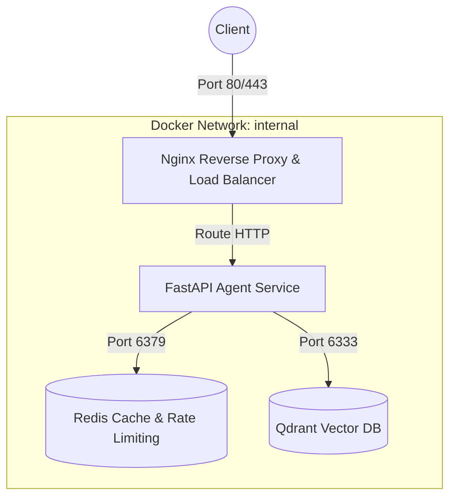
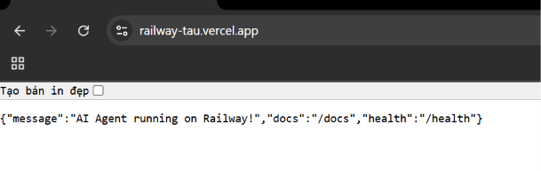

# Day 12 Lab - Mission Answers

## Part 1: Localhost vs Production

### Exercise 1.1: Anti-patterns found in develop/app.py
1. **Hardcoded Secrets:** API key (`OPENAI_API_KEY`) và Database URL (`DATABASE_URL`) bị gán cứng (hardcode) trong mã nguồn. Nếu đẩy code lên GitHub, các khóa bí mật này sẽ bị lộ ngay lập tức.
2. **Thiếu Config Management:** Các cấu hình ứng dụng (`DEBUG`, `MAX_TOKENS`) bị viết cứng trong code, không cho phép thay đổi linh hoạt theo từng môi trường chạy (Development, Staging, Production).
3. **Sử dụng lệnh `print()` và rò rỉ dữ liệu nhạy cảm:** Sử dụng hàm `print()` thay vì thư viện logging chuyên dụng. Đồng thời, in trực tiếp API Key bí mật ra màn hình log console (`print(f"[DEBUG] Using key: {OPENAI_API_KEY}")`).
4. **Không có Health Check Endpoints:** Thiếu các endpoint kiểm tra trạng thái hoạt động của dịch vụ (`/health`, `/ready`), khiến Cloud Platform hoặc Kubernetes không thể tự động theo dõi, định tuyến traffic hoặc tự động restart container khi app bị treo.
5. **Khóa cứng Host và Port:** Sử dụng `host="localhost"` (chỉ nhận request từ máy cục bộ, không thể kết nối từ Docker hay bên ngoài) và `port=8000` (port cố định thay vì đọc động qua biến môi trường `PORT` của cloud).
6. **Bật chế độ `reload=True` trên Production:** Chế độ debug auto-reload làm suy giảm nghiêm trọng hiệu năng hệ thống và có nguy cơ rò rỉ thông tin debug nhạy cảm.

### Exercise 1.3: Comparison table
| Feature | Basic (Develop) | Advanced (Production) | Tại sao quan trọng? |
| :--- | :--- | :--- | :--- |
| **Config** | Hardcode trực tiếp trong code | Load động từ Env vars qua `config.py` | Bảo mật thông tin nhạy cảm; dễ dàng thay đổi cấu hình giữa các môi trường mà không cần sửa đổi mã nguồn hay build lại code. |
| **Health check** | Không có | Có `/health` (Liveness) & `/ready` (Readiness) | Giúp Cloud Platform hoặc Kubernetes tự động kiểm tra trạng thái ứng dụng để tự khởi động lại (restart) khi crash hoặc dừng định tuyến traffic khi app chưa sẵn sàng. |
| **Logging** | Dùng `print()` không cấu trúc, log cả secret | Dùng thư viện `logging` chuẩn, structured JSON | Định dạng JSON giúp các hệ thống quản lý log tập trung (Datadog, Loki) dễ dàng parse và lọc log; tránh in ra các thông tin nhạy cảm. |
| **Shutdown** | Đột ngột (Abrupt) | Graceful Shutdown (dùng FastAPI lifespan & SIGTERM) | Đảm bảo hoàn thành các request đang xử lý dở dang, đóng kết nối DB sạch sẽ trước khi tiến trình bị kết thúc hoàn toàn, tránh mất mát dữ liệu. |

---

## Part 2: Docker

### Exercise 2.1: Dockerfile questions
1. **Base image:** `python:3.11` (Bản cài đặt Python đầy đủ, dung lượng lớn ~1 GB).
2. **Working directory:** `/app`.
3. **Tại sao COPY requirements.txt trước?** Để tận dụng cơ chế **Docker layer caching**. Do các thư viện phụ thuộc (`requirements.txt`) ít khi thay đổi hơn mã nguồn (`app.py`), việc copy và cài đặt dependencies trước giúp Docker tái sử dụng cache của layer này ở các lần build sau nếu không có thay đổi trong `requirements.txt`, từ đó tăng tốc độ build đáng kể.
4. **CMD vs ENTRYPOINT khác nhau thế nào?**
   - **`CMD`:** Thiết lập lệnh chạy mặc định khi khởi tạo container, có thể bị ghi đè hoàn toàn một cách dễ dàng nếu người dùng truyền lệnh khác khi thực hiện `docker run`.
   - **`ENTRYPOINT`:** Định nghĩa lệnh chạy cố định khó bị ghi đè hơn. Khi người dùng truyền thêm đối số lúc chạy `docker run`, các đối số này sẽ được truyền làm tham số đầu vào cho lệnh của `ENTRYPOINT` (chứ không ghi đè lên lệnh đó). Ngoài ra, ta có thể kết hợp `ENTRYPOINT` (chỉ định binary/câu lệnh chạy) và `CMD` (làm tham số mặc định).


### Exercise 2.3: Multi-stage build & Image size comparison

#### 1. So sánh kích thước (Ước lượng thực tế):
- **Develop (Basic):** Khoảng ~1.02 GB (Dùng base image `python:3.11` đầy đủ).
- **Production (Advanced - Multi-stage):** Khoảng ~150 - 180 MB (Dùng base image `python:3.11-slim` kết hợp Multi-stage build).
- **Mức độ chênh lệch:** Giảm khoảng **~85%** dung lượng.

#### 2. Tại sao Docker image đầu tiên (Develop) lại nặng?
- **Sử dụng Base Image đầy đủ:** Lệnh `FROM python:3.11` tải về một bản phân phối Python hoàn chỉnh dựa trên Ubuntu/Debian. Bản này bao gồm rất nhiều công cụ phát triển (như trình biên dịch `gcc`, `g++`, các công cụ build nâng cao `make`, `build-essential`, v.v.) và các thư viện hệ thống (system libraries) nặng nề không cần thiết khi chạy ứng dụng trong thực tế.
- **Single-stage build:** Toàn bộ quá trình từ chuẩn bị công cụ, biên dịch dependencies cho tới copy code đều diễn ra trên một image duy nhất. Mọi file rác, cache cài đặt (`pip cache`) phát sinh trong lúc build đều bị giữ lại trong image thành phẩm.

#### 3. Tại sao Docker image thứ hai (Production) lại nhẹ hơn nhiều?
Nhờ kết hợp 2 kỹ thuật tối ưu hóa cốt lõi:
- **Sử dụng Base Image rút gọn (Slim):** Cả hai giai đoạn đều bắt đầu từ `python:3.11-slim`, phiên bản rút gọn tối đa dựa trên Debian-slim, đã lược bỏ hầu hết các build tools hệ thống cồng kềnh, chỉ giữ lại runtime Python tối thiểu (dung lượng base image chỉ khoảng ~120 MB).
- **Áp dụng cơ chế Multi-stage Build (Xây dựng nhiều giai đoạn):**
  - **Stage 1 (Builder):** Sử dụng `python:3.11-slim AS builder`. Giai đoạn này cài đặt các công cụ build cần thiết (`gcc`, `libpq-dev`) để biên dịch và cài đặt các thư viện phụ thuộc (`requirements.txt`) vào thư mục cục bộ `/root/.local`. Stage này chấp nhận dung lượng lớn vì nó chỉ dùng để build, không dùng để chạy trực tiếp.
  - **Stage 2 (Runtime):** Sử dụng `python:3.11-slim AS runtime`. Giai đoạn này chỉ copy những gì thực sự cần thiết từ Stage 1 sang (chỉ copy thư mục chứa các thư viện đã cài đặt `/root/.local` và source code chính) bằng lệnh `COPY --from=builder`.
  - **Kết quả:** Tất cả các công cụ build nặng nề (`gcc`, `libpq-dev`, cache của pip) được dùng ở Stage 1 hoàn toàn bị bỏ lại phía sau và không xuất hiện trong image sản phẩm cuối cùng. Điều này giữ cho image chạy production cực kỳ nhẹ và an toàn.

### Exercise 2.4: Docker Compose stack

#### 1. Các Services được khởi động:
- **`agent`:** FastAPI AI Agent. Chạy logic chính của Agent và tiếp nhận các truy vấn API.
- **`redis`:** Redis server (`7-alpine`), giới hạn memory tối đa 256MB và dùng thuật toán LRU để dọn cache. Dùng cho lưu trữ session/lịch sử trò chuyện và giới hạn lưu lượng (rate limiting).
- **`qdrant`:** Vector Database (`v1.9.0`) hỗ trợ tìm kiếm ngữ nghĩa và lưu trữ tri thức cho RAG.
- **`nginx`:** Reverse Proxy & Load Balancer (`alpine`), nhận traffic từ cổng `80` và `443` ở máy host và phân tải tới service `agent`.

#### 2. Cách thức các Services giao tiếp (Communication):
- Tất cả các services cùng tham gia vào một mạng ảo biệt lập (`bridge`) tên là **`internal`**.
- Các service giao tiếp với nhau bằng cơ chế **Docker DNS nội bộ** thông qua tên của service (Service Name):
  - `agent` kết nối tới `redis` qua địa chỉ: `redis://redis:6379/0`
  - `agent` kết nối tới `qdrant` qua địa chỉ: `http://qdrant:6333`
  - `nginx` định tuyến (reverse-proxy) các yêu cầu từ bên ngoài tới `agent` qua địa chỉ: `http://agent:8000`
- **Bảo mật:** Chỉ có cổng `80` và `443` của service `nginx` là được công khai (expose) ra ngoài máy host. Các cổng của `agent` (8000), `redis` (6379), và `qdrant` (6333) đều bị ẩn khỏi môi trường bên ngoài để đảm bảo an ninh tuyệt đối cho hệ thống nội bộ.

#### 3. Architecture Diagram:


---

## Part 3: Cloud Deployment

### Exercise 3.1: Railway deployment (Vercel alternative used due to Railway workspace restriction)
- **URL:** https://railway-tau.vercel.app/
- **Screenshot:** 


---

## Part 4: API Security

### Exercise 4.1: API Key authentication
- **API key được check ở đâu?**
  - API key được kiểm tra tại hàm dependency `verify_api_key()` (dòng 39-54 trong `04-api-gateway/develop/app.py`). Hàm này được định nghĩa như một dependency của FastAPI và được inject trực tiếp vào endpoint `/ask` thông qua dependency injection: `_key: str = Depends(verify_api_key)`.
  - Giá trị của API key được trích xuất từ HTTP header có tên `X-API-Key` thông qua đối tượng `APIKeyHeader(name="X-API-Key", auto_error=False)`.

- **Điều gì xảy ra nếu sai key?**
  - Nếu thiếu API key (không truyền header `X-API-Key`), ứng dụng sẽ trả về mã lỗi HTTP **401 Unauthorized** kèm thông điệp: `"Missing API key. Include header: X-API-Key: <your-key>"`.
  - Nếu truyền sai API key (không khớp với biến môi trường `AGENT_API_KEY`), ứng dụng sẽ trả về mã lỗi HTTP **403 Forbidden** kèm thông điệp: `"Invalid API key."`.

- **Làm sao rotate key?**
  - Khóa bảo mật được tải động từ biến môi trường `AGENT_API_KEY` (thông qua `os.getenv("AGENT_API_KEY")`).
  - Để rotate (xoay vòng/đổi) API key, ta chỉ cần thay đổi giá trị của biến môi trường `AGENT_API_KEY` trên cấu hình hosting (như Vercel, Railway, Render, hoặc file `.env`), sau đó khởi động lại dịch vụ (restart/redeploy). Không cần phải thay đổi mã nguồn.

### Exercise 4.3: Rate limiting
- **Algorithm nào được dùng?**
  - Thuật toán **Sliding Window Counter** (Cửa sổ trượt) được sử dụng.
  - Mỗi user có một hàng đợi double-ended queue (`deque`) chứa các timestamp của các request gần nhất. Khi có request mới, các timestamp cũ vượt quá cửa sổ trượt (60 giây) sẽ bị loại bỏ khỏi hàng đợi (`window.popleft()`), sau đó độ dài của hàng đợi được so sánh với giới hạn để quyết định xem có cho phép request đi tiếp hay không.

- **Limit là bao nhiêu requests/minute?**
  - Người dùng thông thường (`user` / student): **10 requests/minute**.
  - Người dùng quản trị (`admin` / teacher): **100 requests/minute**.

- **Làm sao bypass limit cho admin?**
  - Hệ thống không bỏ qua hoàn toàn giới hạn đối với Admin mà áp dụng **Phân cấp Giới hạn (Tiered Limits)** dựa trên vai trò (role) được trích xuất từ JWT token.
  - Trong `app.py` dòng 140:
    ```python
    limiter = rate_limiter_admin if role == "admin" else rate_limiter_user
    ```
    Nếu là tài khoản `admin`, hệ thống sẽ áp dụng đối tượng `rate_limiter_admin` với giới hạn nới rộng lên tới **100 requests/minute** (thay vì 10 requests/minute của user thường).

### Exercise 4.4: Cost guard implementation
Dưới đây là phần code cài đặt hàm `check_budget` sử dụng Redis để lưu trữ và quản lý hạn mức chi tiêu hàng tháng (budget) của từng user:

```python
import redis
from datetime import datetime

# Khởi tạo kết nối tới Redis
r = redis.Redis(host='localhost', port=6379, decode_responses=True)

def check_budget(user_id: str, estimated_cost: float) -> bool:
    """
    Kiểm tra hạn mức chi tiêu của người dùng trong tháng hiện tại.
    Trả về True nếu còn budget, False nếu vượt quá.
    """
    # 1. Định nghĩa key theo định dạng budget:user_id:YYYY-MM để tự động reset theo tháng
    month_key = datetime.now().strftime("%Y-%m")
    key = f"budget:{user_id}:{month_key}"
    
    # 2. Lấy số tiền đã tiêu trong tháng của user từ Redis
    current = float(r.get(key) or 0)
    
    # 3. Kiểm tra xem nếu cộng thêm chi phí ước tính của request hiện tại có vượt $10/tháng không
    if current + estimated_cost > 10.0:
        return False
    
    # 4. Nếu chưa vượt quá, ghi nhận chi phí mới bằng cách cộng dồn trong Redis
    r.incrbyfloat(key, estimated_cost)
    
    # 5. Đặt thời gian hết hạn (TTL) là 32 ngày để key tự động được dọn dẹp sau khi sang tháng mới
    r.expire(key, 32 * 24 * 3600)  # 32 days
    
    return True
```

**Giải thích cách tiếp cận:**
1. **Thiết kế Key dạng `budget:{user_id}:{YYYY-MM}`**: Việc thêm thông tin năm-tháng vào key giúp tự động tách biệt dữ liệu chi tiêu giữa các tháng khác nhau, qua đó đạt được cơ chế tự động reset ngân sách khi bắt đầu tháng mới mà không cần chạy các cronjob xóa dữ liệu thủ công.
2. **Sử dụng lệnh `r.incrbyfloat`**: Đây là thao tác nguyên tử (atomic operation) giúp cập nhật giá trị chi phí số thực một cách an toàn kể cả khi có nhiều request đồng thời từ một user gửi đến nhiều instance của agent (tránh race condition).
3. **Đặt TTL 32 ngày**: Bằng việc cấu hình `expire` sau mỗi lần cập nhật, các key cũ sẽ tự động bị xóa khỏi Redis sau khi tháng kết thúc, giúp tiết kiệm bộ nhớ RAM cho hệ thống.

---

## Part 5: Scaling & Reliability

### Exercise 5.1-5.5: Implementation notes

#### 1. Cài đặt Probes (Liveness & Readiness Probes)
* **Liveness Probe (`/health`)**: Trả về trạng thái hoạt động tổng thể của tiến trình (`status: ok` hoặc `degraded`). Nó kiểm tra tài nguyên hệ thống (CPU, RAM qua `psutil`). Nếu container bị treo hoặc hết RAM (>90%), endpoint này sẽ fail, thông báo cho cloud provider restart lại container.
* **Readiness Probe (`/ready`)**: Kiểm tra xem ứng dụng đã sẵn sàng xử lý traffic chưa. Trả về mã lỗi `503 Service Unavailable` nếu biến trạng thái `_is_ready` là `False` (đang khởi động hoặc đang tắt). Load balancer sẽ dừng chuyển traffic tới instance này cho tới khi nó sẵn sàng.

#### 2. Graceful Shutdown (Tắt máy an toàn)
* Bắt tín hiệu hệ thống `SIGTERM` và `SIGINT` thông qua module `signal` của Python.
* Khi có tín hiệu tắt container, ứng dụng sẽ chuyển `_is_ready = False` ngay lập tức để Readiness probe báo `503` nhằm ngắt định tuyến traffic mới từ Load Balancer.
* Sử dụng vòng lặp kiểm tra biến `_in_flight_requests` để đợi các request hiện tại đang xử lý dở dang được hoàn tất (tối đa 30 giây) trước khi đóng các kết nối Database/Redis và kết thúc tiến trình sạch sẽ (`sys.exit(0)`).

#### 3. Stateless Design (Thiết kế phi trạng thái)
* Không lưu trữ lịch sử trò chuyện (`conversation_history`) hay session trong RAM của container (anti-pattern vì gây lệch dữ liệu khi scale ra nhiều instance hoặc khi container bị restart).
* Sử dụng Redis làm cơ sở dữ liệu tập trung lưu trữ trạng thái. Các câu lệnh `r.lrange()` và `r.rpush()` được dùng để đọc/ghi lịch sử hội thoại của user. Nhờ đó, bất cứ instance nào sau Load Balancer đều có thể xử lý request tiếp theo của user mà không bị mất dữ liệu ngữ cảnh.
* **Câu hỏi trong CODE_LAB.md (Exercise 5.3): Tại sao khi scale ra nhiều instances ta không nên dùng memory cục bộ để lưu lịch sử hội thoại?**
  * **Trả lời**: Vì mỗi instance chạy độc lập và có vùng nhớ RAM riêng biệt. Bộ cân bằng tải (Load Balancer) sẽ phân phối ngẫu nhiên các request của cùng một người dùng tới các instances khác nhau. Nếu lưu history trong RAM cục bộ, instance này sẽ không thể biết được lịch sử trò chuyện được xử lý trước đó bởi instance kia, dẫn tới việc mất ngữ cảnh trò chuyện và hoạt động sai lệch. Việc lưu trữ lịch sử hội thoại trong Redis dùng chung giải quyết triệt để vấn đề này.

#### 4. Load Balancing với Nginx
* Định cấu hình Nginx làm Reverse Proxy nhận lưu lượng từ cổng public `80` và phân phối vòng tròn (Round Robin) đến 3 instances `agent` khác nhau chạy trong mạng nội bộ.
* Nếu một instance bị lỗi, Nginx sẽ tự động phát hiện thông qua liveness probe và chuyển traffic qua 2 instances còn lại, tăng tính sẵn sàng cao (High Availability) cho hệ thống.

---

## Part 6: Final Project

### Exercise 6.1: Complete Production Agent Integration
* **Phương án thực hiện**:
  * Đã tích hợp thành công Agent từ Day 04 có giao diện Trace UI (Next.js) vào thư mục `06-lab-complete`.
  * Hợp nhất tất cả các tiêu chí của ứng dụng chạy Production: cấu hình 12-factor qua Pydantic Settings, xác thực API Key (`X-API-Key`), cơ chế giới hạn tần suất gọi API (Rate Limiting), kiểm soát chi phí LLM (Cost Guard), Endpoint kiểm tra sức khỏe (`/health` và `/ready`), tự động ghi log có cấu trúc (Structured JSON Logging) và tắt máy an toàn giải phóng kết nối (Graceful Shutdown).
  * Chạy script kiểm tra `python check_production_ready.py` đạt điểm số tối đa **20/20 (100% checks passed)**.
  * Tích hợp thành công cấu hình Docker Compose khởi chạy đồng thời:
    * `agent`: FastAPI backend (xử lý logic suy luận agent và các tool).
    * `frontend`: Next.js web application (hiển thị giao diện trực quan và trace log suy nghĩ của model).
    * `redis`: Lưu trữ cache lịch sử trò chuyện và giới hạn cuộc gọi.

### Exercise 6.2: Bonus Point - CI/CD Pipeline
* **Thiết lập CI/CD**:
  * **Pipeline CI (`.github/workflows/ci.yml`)**: Tự động kích hoạt khi có Push hoặc Pull Request vào nhánh `main`. Quy trình kiểm thử toàn diện gồm:
    1. Kiểm tra chuẩn mã nguồn (Ruff Linter).
    2. Chạy bộ kiểm thử tự động của FastAPI Backend (`pytest` + `httpx` TestClient).
    3. Xác thực code Frontend Next.js build thành công (`pnpm run lint` & `pnpm run build`).
    4. Verify Docker build để đảm bảo cả backend Dockerfile và frontend Dockerfile biên dịch thành công.
    5. Chạy `check_production_ready.py` kiểm tra 20/20 tiêu chuẩn Production.
  * **Pipeline CD Vercel (`.github/workflows/deploy-vercel.yml`)**: Tự động build và deploy dự án giao diện frontend Next.js (`06-lab-complete/frontend`) lên Cloud Vercel.
  * **Pipeline CD Docker (`.github/workflows/deploy-docker.yml`)**: Tự động đóng gói và đẩy (push) production-ready Docker images của cả Backend và Frontend lên **GitHub Container Registry (GHCR)** dưới dạng package khi code được trộn (merge) vào nhánh `main`. Các gói image được lưu tại:
    * `ghcr.io/<github_owner>/complete-agent-backend:latest`
    * `ghcr.io/<github_owner>/complete-agent-frontend:latest`
  * **Đường dẫn deploy (Vercel)**: https://railway-tau.vercel.app/

